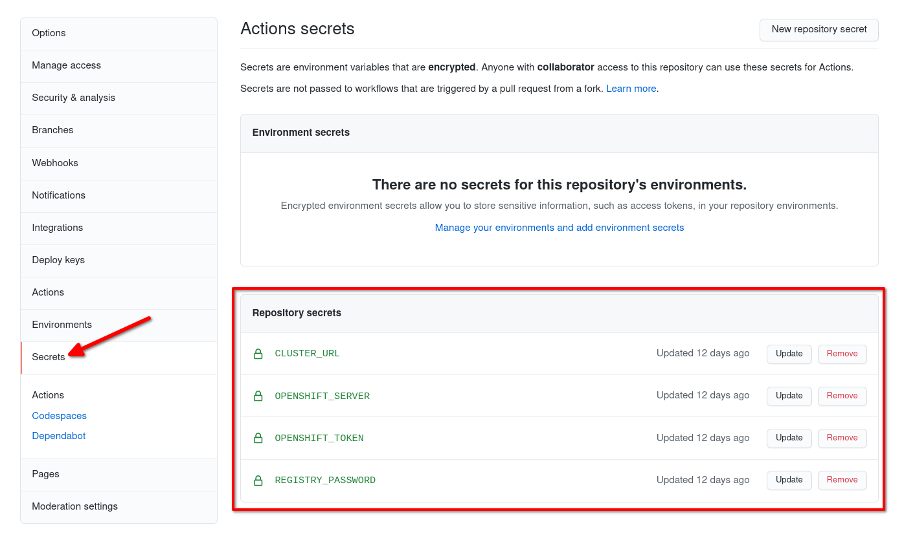

# Spring Boot: Deploying to OpenShift with GitHub Actions and Helm

[](https://quay.io/repository/monodot/spring-boot-helm-openshift-github-actions)

## Setup

### Build and deploy from scratch

You'll need a container image registry to push to. I'm using Quay.io here.

Build and push an image first:

    podman build -t quay.io/YOURNAME/spring-boot-helm-openshift-github-actions .
    podman push quay.io/YOURNAME/spring-boot-helm-openshift-github-actions:latest

    docker build -t quay.io/YOURNAME/spring-boot-helm-openshift-github-actions .
    docker push quay.io/YOURNAME/spring-boot-helm-openshift-github-actions:latest

Once the image has been pushed, install the app into your cluster with this Helm command:

    helm install \
        --set image.repository=quay.io/YOURNAME/spring-boot-helm-openshift-github-actions \
        --set image.tag=latest \
        --set fullnameOverride=myapp-latest \
        myapp-latest helm/myapp

(`fullnameOverride` is a handy value in the Helm chart which lets us choose a name for all the objects - otherwise Helm will use the code in `_helpers.tpl` to generate `myapp.fullname`)

### Set up the GitHub Actions pipeline

To set this up on your own OpenShift cluster:

#### Set up a service account

Create a Service Account for GitHub to use:

```
oc create sa github-robot
oc policy add-role-to-user edit -z github-robot
```

Get the Service Account's authentication token. Extract it from the Secret that was automatically created when you created the Service Account:

```
oc describe secret github-robot-token-xxxxx

# Extract the "token" value from the Secret and base64-decode it.

echo xxxxxxx | base64 -d
```

The resulting string will be your `OPENSHIFT_TOKEN` (see below).

#### Set up the pipeline 

Fork this repo.

In `./github/workflows/build-deploy-openshift.yml`, edit the fields in the `env` block `REGISTRY` and `REGISTRY_USER`, filling in your registry details:

```yaml
env:
  REGISTRY: quay.io/mr_smith
  REGISTRY_USER: mr_smith
```

In your GitHub repository, go to Settings &rarr; Secrets and define the following Repository Secrets:

- `REGISTRY_PASSWORD` - the password to your container image registry you gave above
- `OPENSHIFT_SERVER` - e.g. `api.mycompany.com:6443` 
- `OPENSHIFT_TOKEN` - 
- `CLUSTER_URL` - Set this to the suffix of your cluster. This will mask the URL in GitHub Actions logs. e.g. `cluster.mycompany.com`

Like this:


